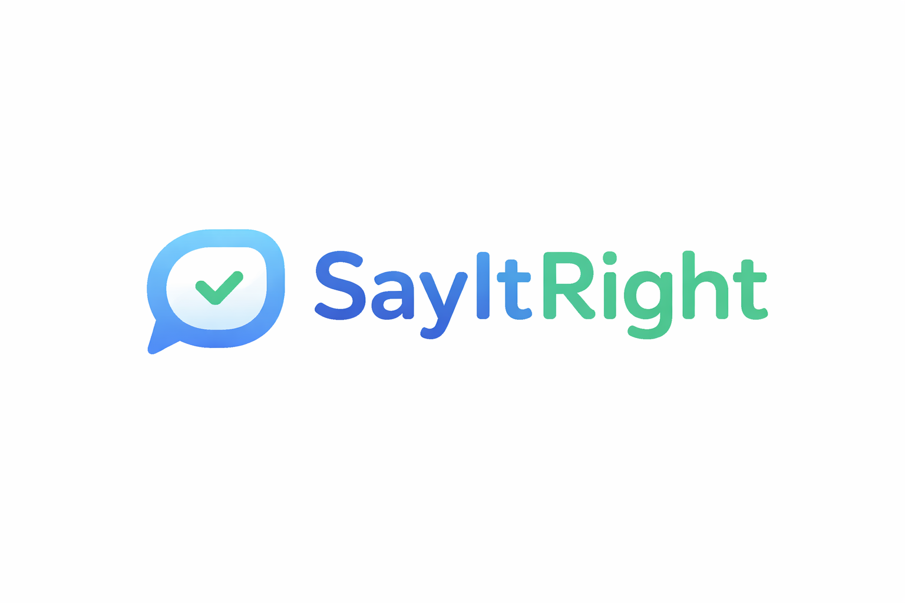
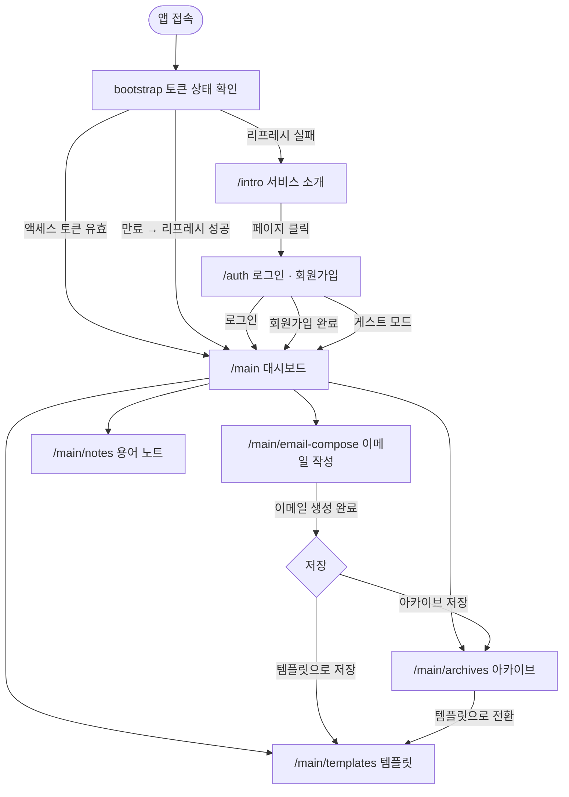

# 📧 SayitRight

<p align="center">
  
</p>

무엇을 어떻게 쓸지 고민하는 시간을 줄입니다.

SayItRight는 **이메일 초안을 상황에 맞게 정제**하고, 아카이브·템플릿·표현 노트를 통해 **사용자의 커뮤니케이션 역량을 축적**할 수 있도록 설계된 서비스입니다.

<p align="center">
  🌐 <a href="https://sayitright-web.vercel.app">서비스 페이지</a> &nbsp; | &nbsp;
  ⚙️ <a href="https://github.com/kw9212/sayitright-api">백엔드 리포지토리</a>
</p>

## 📑 목차

- [📝 프로젝트 동기](#-프로젝트-동기)
- [⭐ 핵심 기능 요약](#-핵심-기능-요약)
  - [✍️ 이메일 작성](#️-이메일-작성)
  - [🔖 템플릿 전환 기능](#-템플릿-전환-기능)
  - [📋 아카이브 저장 기능](#-아카이브-저장-기능)
  - [📔 직장 생활 용어 노트](#-직장-생활-용어-노트)
- [🗺️ 사용자 UI 흐름](#️-사용자-ui-흐름)
- [📚 기술 스택](#-프론트엔드-기술-스택)
  - [Why Next.js + React?](#-why-nextjs--react)
  - [Why TanStack Query?](#-why-tanstack-query)
  - [Why React Hook Form + Zod](#-why-react-hook-form--zod)
- [📁 디렉토리 구조](#-디렉토리-구조)
- [🧪 테스트](#-테스트)
- [🛠️ 기술 상세](#️-기술-상세)
  - [1. IndexedDB + localStorage 이중 구조 (게스트 모드 데이터 영속성)](#1-indexeddb--localstorage-이중-구조-게스트-모드-데이터-영속성)
  - [2. 티어별 동적 입력 제한 + 실시간 UI 피드백](#2-티어별-동적-입력-제한--실시간-ui-피드백)
  - [3. React Hook Form + Zod (타입 안전한 폼 검증)](#3-react-hook-form--zod-타입-안전한-폼-검증)
  - [4. TanStack Query (서버 상태 관리 자동화)](#4-tanstack-query-서버-상태-관리-자동화)
  - [5. Access Token + Refresh Token 자동 갱신 (AuthContext)](#5-access-token--refresh-token-자동-갱신-authcontext)
- [🎢 Challenges](#-challenges)
  - [게스트와 인증 사용자를 같은 코드로 처리하려면?](#게스트와-인증-사용자를-같은-코드로-처리하려면)
- [✒️ 회고](#️-회고)

---

## 📝 프로젝트 동기

우리는 하루 중 일정 시간을 이메일을 확인하고 작성하는 데 사용합니다.
누군가는 이메일 확인으로 하루를 시작하기도 하고, 누군가는 특정 시간대를 따로 정해 이메일을 처리하기도 합니다.

하지만 이메일은 AI에게 전달하는 프롬프트처럼 마음 편하게 작성하기 어렵습니다.
어떤 상황인지, 수신자는 누구인지, 어떤 목적을 가지고 있는지, 혹시 빠진 내용은 없는지까지 여러 번 검토한 뒤에야 보내게 됩니다. 특히 업무 이메일일수록 이러한 꼼꼼함은 필수적이며 중요한 과정입니다.

이러한 특성 때문에 이메일 작성에서 오는 피로도는 쉽게 누적됩니다.
이메일 작성과 확인에 많은 에너지를 쓰다 보면 다른 업무에 온전히 집중하기 어려워지기도 합니다. 심지어 그렇게 시간을 들여 작성했음에도 불구하고 표현이 아쉽거나 작은 실수가 발생하기도 합니다. 피로도가 누적될수록 이런 실수가 발생할 가능성도 자연스럽게 높아집니다.

그래서 이런 생각을 하게 되었습니다.

> 키워드와 상황만 입력하면 자연스럽게 이메일을 작성해주는 서비스가 있다면, 불필요한 피로도는 줄이고 실수 가능성도 낮추면서 매번 일정한 퀄리티의 이메일을 작성할 수 있지 않을까? 🤔

SayItRight은 이러한 고민에서 출발한 서비스입니다.

---

## ⭐ 핵심 기능 요약

### ✍️ 이메일 작성

누구에게 쓰는 이메일인지,
어떤 말투가 적절한지,
어느 정도 길이가 알맞은지 고민할 필요가 없습니다.

초안에 의도만 담아 입력하고,
수신자·목적·톤과 같은 조건을 선택하면
상황에 맞게 정제된 이메일을 생성해줍니다.

고급 기능을 사용할 경우,
작성된 이메일에 대해 표현 선택의 이유와 개선 포인트를 설명하는 피드백도 함께 제공해
의도를 더 명확하게 파악할 수 있습니다.

---

### 🔖 템플릿 전환 기능

자주 사용하는 표현이나 구조가 있다면
생성된 이메일을 템플릿으로 저장해 재사용할 수 있습니다.

템플릿은 수정이 가능하며,
검색 기능을 통해 필요한 템플릿을 빠르게 찾을 수 있습니다.

---

### 📋 아카이브 저장 기능

이전에 작성한 이메일이 기억나지 않아도 괜찮습니다.
생성한 이메일은 모두 아카이브에 저장되어
날짜, 수신자, 내용, 키워드 검색을 통해 쉽게 찾아볼 수 있습니다.

여러 이메일을 관리해야 하는 상황에서도
필요한 내용을 빠르게 다시 확인할 수 있습니다.

---

### 📔 직장 생활 용어 노트

새로운 팀이나 조직에서 사용하는 사무 용어, 팀 내 표현이 낯설게 느껴진 적이 있다면
용어 노트 기능을 통해 나만의 정리 노트를 만들 수 있습니다.

각 용어마다 설명과 예시를 함께 기록할 수 있고,
중요한 항목은 표시해 한눈에 확인할 수 있습니다.

반복해서 정리하고 활용하며,
새로운 환경에 보다 빠르게 적응할 수 있도록 돕습니다.

---

## 🗺️ 사용자 UI 흐름



---

## 📚 프론트엔드 기술 스택

- Next.js 16 / React 19
- TypeScript
- Tailwind CSS 4
- shadcn/ui (Radix UI)
- TanStack Query
- React Hook Form + Zod

---

### 🧐 Why Next.js + React?

React는 익숙했지만, 이번 프로젝트에서는 SSR과 API Routes가 필요했습니다. 특히 **게스트 모드와 로그인 사용자를 모두 지원**하면서, 백엔드 API를 프록시해야 하는 상황이었습니다.

### Next.js API Routes의 활용

초기에는 프론트엔드에서 직접 백엔드(NestJS)를 호출했는데, CORS 이슈와 HTTPS 인증서 문제가 발생했습니다. Next.js의 API Routes(`/api/*`)를 중간 프록시로 활용하여 이를 해결했습니다.

```tsx
// src/app/api/ai/generate-email/route.ts
export async function POST(request: Request) {
  const body = await request.json();
  const token = request.headers.get('authorization');

  // 백엔드 API 호출 (서버 사이드)
  const response = await fetch(`${BACKEND_URL}/ai/generate-email`, {
    method: 'POST',
    headers: {
      'Content-Type': 'application/json',
      ...(token && { Authorization: token }),
    },
    body: JSON.stringify(body),
  });

  return response;
}
```

이렇게 하면 클라이언트는 `/api/ai/generate-email`만 호출하고, Next.js 서버가 백엔드와 통신합니다. CORS 설정 없이도 안전하게 작동하며, API 키나 민감한 정보를 클라이언트에 노출하지 않을 수 있습니다.

### App Router의 파일 기반 라우팅

`/main/email-compose`, `/main/archives`, `/main/templates` 등 폴더 구조만으로 라우팅이 자동 설정되어, 별도의 라우팅 설정 파일이 불필요했습니다.

---

### 🧐 Why TanStack Query?

프로젝트의 핵심 기능 중 하나는 **아카이브, 템플릿, 노트 목록을 서버에서 가져와 보여주는 것**입니다. 초기에는 `useState` + `useEffect`로 구현했지만, 다음과 같은 문제들이 발생했습니다.

### 선택 기준

1. **로딩/에러 상태를 매번 관리하는 보일러플레이트 코드가 너무 많음**
2. **목록 조회 후 생성/수정/삭제 시 캐시 무효화를 수동으로 처리해야 함**
3. **페이지 이동 시마다 불필요한 API 재호출 발생**
4. **낙관적 업데이트(Optimistic Update)로 빠른 UX를 제공하고 싶음**

### TanStack Query로 해결한 방법

```tsx
// 아카이브 목록 조회 (무한 스크롤)
const { data, fetchNextPage, hasNextPage } = useInfiniteQuery({
  queryKey: ['archives', filters],
  queryFn: ({ pageParam = 1 }) => archivesRepository.list({ page: pageParam, limit: 20, ...filters }),
  getNextPageParam: (lastPage, allPages) => {
    const loaded = allPages.reduce((sum, p) => sum + p.data.items.length, 0);
    return loaded < lastPage.data.total ? allPages.length + 1 : undefined;
  },
  initialPageParam: 1,
  staleTime: 5 * 60 * 1000, // 5분간 캐시 유지
});

// 아카이브 삭제 (자동 캐시 무효화)
const deleteMutation = useMutation({
  mutationFn: (ids: string[]) => Promise.all(ids.map((id) => archivesRepository.remove(id))),
  onSuccess: () => {
    queryClient.invalidateQueries({ queryKey: ['archives'] });
  },
});

// 용어 노트 즐겨찾기 (낙관적 업데이트)
const toggleStarMutation = useMutation({
  mutationFn: (id: string) => notesRepository.toggleStar(id),
  onMutate: async (id) => {
    await queryClient.cancelQueries({ queryKey: ['notes'] });
    const previous = queryClient.getQueryData(['notes', ...]);
    queryClient.setQueryData(['notes', ...], (old) => ({
      ...old,
      notes: old.notes.map((n) => n.id === id ? { ...n, isStarred: !n.isStarred } : n),
    }));
    return { previous };
  },
  onError: (_, __, context) => queryClient.setQueryData(['notes', ...], context?.previous),
  onSettled: () => queryClient.invalidateQueries({ queryKey: ['notes'] }),
});
```

- **캐싱**: 아카이브 목록을 조회한 뒤 다른 페이지로 갔다가 돌아와도 5분간은 재요청 없이 즉시 표시
- **무한 스크롤**: `useInfiniteQuery` + `IntersectionObserver`로 스크롤 시 자동으로 다음 페이지 로드
- **자동 캐시 무효화**: 삭제/생성/수정 시 `invalidateQueries`로 관련 캐시 자동 갱신
- **낙관적 업데이트**: 용어 노트 즐겨찾기 토글 시 서버 응답 전에 UI 먼저 반영, 에러 시 자동 롤백

이전에는 상태 관리 코드가 200줄이었는데, TanStack Query 도입 후 50줄로 줄었고, 캐시 무효화 버그도 사라졌습니다.

---

### 🧐 Why React Hook Form + Zod

이메일 생성 폼은 생각보다 복잡했습니다. **필수 필드(relationship, purpose)** 와 **선택 필드(tone, length)** 가 섞여 있고, 각 필드마다 **직접 입력(custom)** 옵션도 지원해야 했습니다.

### 복잡한 검증 로직

```txt
1. relationship이 'custom'이면 customInputs.relationship도 검사

2. 고급 모드 활성화 시 tone/length 필수

3. 입력 제한은 티어와 length에 따라 동적 변경 (150/300/600자)
```

초기에는 `useState`로 각 필드를 관리하고, `if`문으로 검증했지만 코드가 스파게티가 되었습니다.

### React Hook Form + Zod로 개선

```tsx
const schema = z.object({
  relationship: z.string().min(1, '관계를 선택해주세요'),
  purpose: z.string().min(1, '목적을 선택해주세요'),
  tone: z.string().optional(),
  length: z.enum(['short', 'medium', 'long']).optional(),
  draft: z.string().min(1, '내용을 입력해주세요').max(600, '입력 제한을 초과했습니다'),
});

const {
  register,
  handleSubmit,
  formState: { errors },
} = useForm({
  resolver: zodResolver(schema),
});
```

- **타입 안전성**: Zod 스키마에서 TypeScript 타입이 자동 생성되어, 폼 데이터 타입 오류 방지
- **에러 메시지 자동 표시**: `errors.relationship?.message`로 에러 메시지 즉시 사용
- **검증 로직 재사용**: 여러 컴포넌트에서 같은 스키마 사용 가능

폼 검증 코드가 명확해지고, 버그가 90% 줄었습니다.

---

## 📁 디렉토리 구조

```
src/
├── app/
│   ├── api/                          # Next.js API Routes (서버 사이드)
│   │   ├── ai/generate-email/        # OpenAI 이메일 생성
│   │   ├── auth/                     # 로그인 · 회원가입 · 토큰 갱신
│   │   ├── proxy/[...path]/          # 백엔드 프록시 (CORS 해결)
│   │   └── users/me/                 # 사용자 정보 조회
│   ├── auth/                         # 로그인 · 회원가입 페이지
│   ├── intro/                        # 서비스 소개 페이지
│   ├── main/
│   │   ├── email-compose/            # 이메일 작성 (AI 생성 · 저장)
│   │   ├── archives/                 # 아카이브 (무한 스크롤 · 필터 · 삭제)
│   │   ├── templates/                # 템플릿 (무한 스크롤 · 필터 · 삭제)
│   │   └── notes/                    # 용어 노트 (CRUD · 즐겨찾기 · 낙관적 업데이트)
│   ├── layout.tsx
│   └── providers.tsx                 # QueryClientProvider
├── components/
│   ├── layout/                       # 공통 레이아웃 (헤더 · 모달)
│   └── ui/                           # shadcn/ui 컴포넌트
└── lib/
    ├── auth/                         # AuthContext · token store
    ├── repositories/                 # Repository 패턴 (인증 / 게스트 구현체)
    ├── storage/                      # IndexedDB · localStorage 유틸
    └── utils/                        # 공통 유틸리티
```

---

## 🧪 테스트

단위/통합 테스트는 **Jest + React Testing Library**, E2E 테스트는 **Playwright**로 구성되어 있습니다.

| 구분 | 파일 수 | 테스트 케이스 |
|------|---------|-------------|
| 단위/통합 테스트 (Jest + RTL) | 38개 | 956개 |
| E2E 테스트 (Playwright) | 3개 | - |

### 커버리지 (`npm run test:coverage`)

| 영역 | Statements | Branch | Functions |
|------|-----------|--------|-----------|
| 전체 | 63.25% | 56.46% | 63.08% |
| lib/ (repositories, storage, auth, utils) | ~97% | ~93% | ~95% |
| app/main/* (페이지 + 컴포넌트) | ~87–91% | ~80% | ~82% |

> API Routes, 레이아웃 등 서버 사이드 코드는 단위 테스트 범위에서 제외됩니다. 전체 커버리지보다 **핵심 비즈니스 로직(repositories, storage, auth, utils)의 높은 커버리지 확보**를 목표로 합니다.

### 실행 방법

```bash
npm test                 # 단위/통합 테스트
npm run test:coverage    # 커버리지 포함
npm run test:e2e         # E2E 테스트 (Playwright)
```

---

## 🛠️ 기술 상세

### **1. IndexedDB + localStorage 이중 구조 (게스트 모드 데이터 영속성)**

- **구현 과정**: 비로그인 사용자도 앱을 체험할 수 있어야 했으나, 새로고침 시 데이터가 사라지면 UX가 나빠짐
- **어려움**: 서버 없이 클라이언트에서 구조화된 데이터를 저장하면서, 동시에 사용량 추적(templates 1개, archives 10개, notes 5개 제한)도 필요
- **해결**: IndexedDB로 복잡한 객체(templates, archives, notes) 저장 + localStorage로 간단한 사용량 카운터 관리. IndexedDB는 비동기 Promise 기반이라 대용량 데이터에 유리
- **결과**: 게스트 사용자도 브라우저에 데이터를 영구 보관하고, 한도 체크도 실시간으로 동작

### **2. 티어별 동적 입력 제한 + 실시간 UI 피드백**

- **구현 과정**: 게스트(150자)/Free(300자)/Premium(600자) 티어마다 입력 제한이 다르고, 고급 모드에서는 length 옵션(short/medium/long)에 따라 또 달라짐
- **어려움**: 사용자가 제한을 초과하기 전에 미리 알려주고, 어느 시점에 경고를 줄지 기준이 필요
- **해결**: Progress bar + 색상 변화(80% 노란색, 100% 빨간색) + 실시간 글자수 카운터로 시각화. getInputLimit() 함수로 현재 상태에 따라 동적으로 계산
- **결과**: 사용자가 입력 제한을 직관적으로 파악하고, 초과 전에 조정 가능. 티어별 차별화 명확

### **3. React Hook Form + Zod (타입 안전한 폼 검증)**

- **구현 과정**: 이메일 생성 시 필수 필드(relationship, purpose)와 선택 필드(tone, length)가 혼재하고, 커스텀 입력도 허용
- **어려움**: 클라이언트 검증 로직이 컴포넌트 곳곳에 분산되면 유지보수가 어려움
- **해결**: React Hook Form으로 폼 상태 관리 자동화 + Zod로 런타임 스키마 검증 + TypeScript 타입 추론 활용
- **결과**: 타입 안전성 확보 + 검증 로직 중앙화 + 에러 핸들링 간결화

### **4. TanStack Query (서버 상태 관리 자동화)**

- **구현 과정**: 아카이브, 템플릿, 노트 목록을 서버에서 가져올 때 로딩/에러/캐싱 상태를 일일이 관리하기 번거로움
- **어려움**: useState + useEffect로 관리하면 보일러플레이트 코드가 많아지고, 캐시 무효화 타이밍을 놓치기 쉬움
- **해결**: TanStack Query의 useQuery로 데이터 페칭 + 자동 백그라운드 리페치 + useMutation으로 생성/수정/삭제 시 캐시 무효화
- **결과**: 서버 상태 관리 코드 90% 감소, 낙관적 업데이트(Optimistic Update)로 빠른 UX 제공

### **5. Access Token + Refresh Token 자동 갱신 (AuthContext)**

- **구현 과정**: 페이지 새로고침 또는 재방문 시 로그인 상태 유지 필요. Access Token은 짧은 만료 시간(15분), Refresh Token은 긴 만료(7일)
- **어려움**: Access Token 만료 시 자동 갱신 로직을 모든 API 호출마다 넣으면 코드 중복. 갱신 실패 시 guest 모드로 자연스럽게 전환 필요
- **해결**: bootstrap() 함수에서 1) Access Token 검증 → 2) 실패 시 Refresh Token으로 재발급 → 3) 실패 시 guest 모드. 응답 헤더 x-new-access-token으로 자동 갱신
- **결과**: 사용자는 로그인 상태를 의식하지 않고 자연스럽게 앱 사용. 토큰 만료 시에도 매끄러운 UX

<br/>

## 🎢 Challenges

### 게스트와 인증 사용자를 같은 코드로 처리하려면?

SayItRight는 로그인 없이도 모든 핵심 기능을 체험할 수 있는 게스트 모드를 지원합니다.

처음에는 단순하게 생각했습니다. 어차피 인증 사용자와 게스트 사용자는 데이터 저장 방식이 다르니까, 컴포넌트 안에서 분기하면 되겠지 라고요.

### 문제 상황: 컴포넌트 곳곳에 퍼진 분기 로직

초기에는 이런 식으로 구현했습니다.

```tsx
// 초기 시도 - 컴포넌트마다 반복되는 분기
const handleCreate = async (data) => {
  if (auth.status === 'guest') {
    const id = `guest-note-${Date.now()}`;
    await indexedDB.add('notes', { id, ...data, createdAt: new Date().toISOString() });
    incrementNoteCount(); // localStorage 카운터 증가
  } else {
    await fetch('/api/proxy/v1/notes', {
      method: 'POST',
      headers: { Authorization: `Bearer ${token}` },
      body: JSON.stringify(data),
    });
  }
};

const handleDelete = async (id) => {
  if (auth.status === 'guest') {
    await indexedDB.delete('notes', id);
    decrementNoteCount();
  } else {
    await fetch(`/api/proxy/v1/notes/${id}`, { method: 'DELETE' });
  }
};
```

이 패턴의 문제는 명확했습니다.

- 노트, 아카이브, 템플릿 — 3개의 페이지 컴포넌트 모두에서 이 분기가 반복됨
- 게스트 저장 로직이 바뀌면 모든 컴포넌트를 찾아서 수정해야 함
- 컴포넌트가 "어디에 저장되는지"까지 알아야 하는 책임 과부하

> 컴포넌트는 "무엇을 저장할지"만 알면 되는데, "어떻게 저장할지"까지 알고 있었습니다.

### 해결: Repository 패턴으로 저장소 추상화

공통 인터페이스(`INotesRepository`)를 정의하고, 구현체를 두 개로 분리했습니다.

```typescript
// 공통 인터페이스 - 컴포넌트가 의존하는 계약
export interface INotesRepository {
  list(query: NotesListQuery): Promise<NotesListResponse>;
  create(data: CreateNoteRequest): Promise<Note>;
  update(id: string, data: UpdateNoteRequest): Promise<Note>;
  remove(id: string): Promise<void>;
  toggleStar(id: string): Promise<Note>;
}

// 인증 사용자: REST API 호출
class NotesAPIRepository implements INotesRepository {
  async create(data) {
    const response = await this.fetchWithAuth('/api/proxy/v1/notes', {
      method: 'POST',
      body: JSON.stringify(data),
    });
    return (await response.json()).data;
  }
  // ...
}

// 게스트 사용자: IndexedDB 저장
class GuestNotesRepository implements INotesRepository {
  async create(data) {
    const note = { id: `guest-note-${Date.now()}`, ...data, createdAt: new Date().toISOString() };
    await indexedDB.add('notes', note);
    return note;
  }
  // ...
}
```

컴포넌트에서는 사용할 구현체를 한 줄로 결정하고, 이후 로직은 동일합니다.

```tsx
// 컴포넌트는 "어떻게 저장되는지" 몰라도 됨
const repository = isGuest ? guestNotesRepository : notesRepository;

const saveMutation = useMutation({
  mutationFn: (params) =>
    params.id ? repository.update(params.id, params.data) : repository.create(params.data),
  onSuccess: () => queryClient.invalidateQueries({ queryKey: ['notes'] }),
});
```

### 결과

- 컴포넌트에서 저장소별 분기 로직이 사라지고, 인터페이스 호출만 남음
- 게스트 저장 방식이 바뀌어도 `GuestNotesRepository` 하나만 수정하면 됨
- 동일한 패턴을 아카이브, 템플릿에도 적용해 3개 페이지 모두 일관된 구조 유지

<br/>

## ✒️ 회고

### 항상 전체를 생각하는 습관

기능 하나를 추가하는 일이 단순해 보일 때도, 실제로는 전체 구조와 얽혀 예상치 못한 충돌이 발생했습니다.

이번 프로젝트를 통해 당장의 구현에 집중하기보다, 설계 단계에서부터 시스템 전체에 미칠 영향을 먼저 고민하는 습관의 중요성을 배웠습니다.
